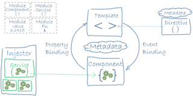
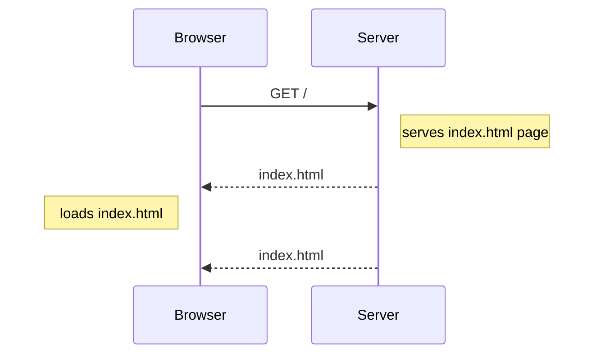
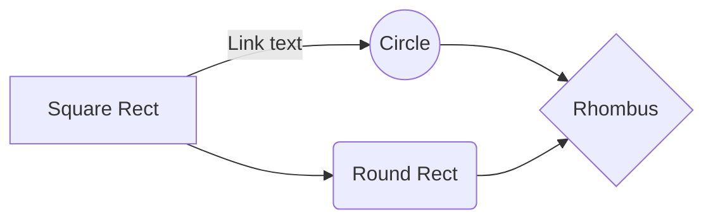

# Angular SPA

Angular is available as 3 different distributions. 

- Apache Kafka  https://kafka.apache.org/ [Free]
- Confluent Open Source [Free]
- Confluent Enterprise [Paid]



## Apache Kafka

Apache Kafka is a vanila distribution, managed by Apache Foundation. Below components are part of Apache Kafka distribution

- Kafka Broker
- Kafka Connect
- Kafka Cli Tools (manage topics, console consumer/producers)
- Zookeeper (can be installed separately)


## Confluent Open Source Kafka

Confluent Open source Kafka comes with below components, Schema registry, KSQL are free and open source component, developed by Confluent team.

- Kafka Broker
- Kafka Connect
- Schema Registry
- KSQL
- Kafka Cli
- Zoo Keeper


## Confluent Enterprise Kafka

- Includes all components from Confluent Open Source + 
- Confluent Control Centre
- Monitor Kafka
- Replications
- Provisions to log metrics

## Sequence

```sequence
Browser->Server: GET /
Note right of Server: serves index.html page
Server-->Browser: index.html
Note left of Browser: loads index.html
Server-->Browser: index.html
```



## Mermaid



