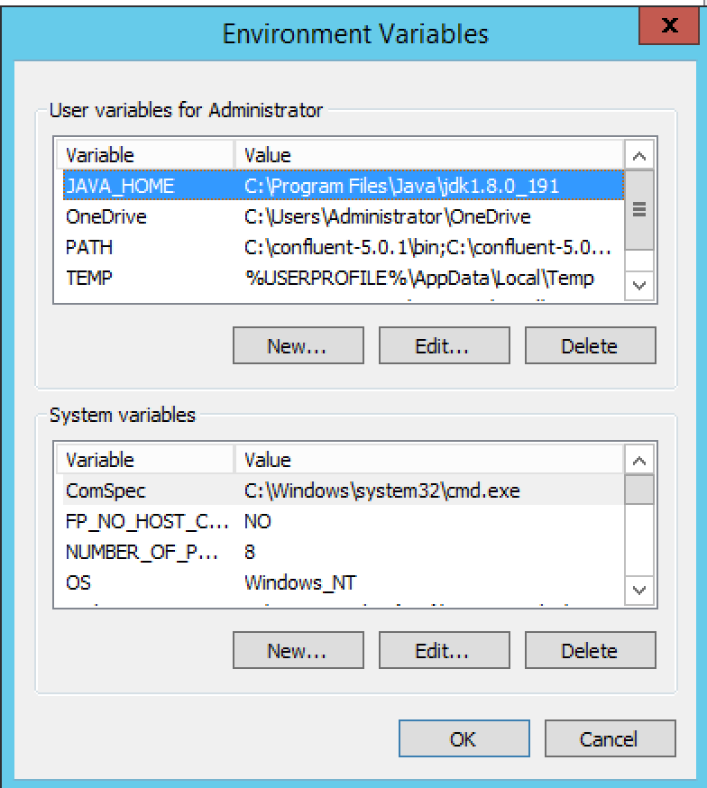

# Kafka Setup Windows

This instruction is for Kafka for development only,  to be installed on your laptop/PC, in an unsecured environment.
Do NOT follow these instruction if you go for Kafka on production. We shall discuss kafka in production in different page.

### System requirements

- Windows 7, Windows 8, Windows 8 or latest
- Minimum 20 GB free
- Minimum 8 GB RAM
- 64 bit processor

### Java JDK Setup

- [Java JDK 1.8] (https://www.oracle.com/technetwork/java/javase/downloads/jdk8-downloads-2133151.html)
- Download Windows x64 (jdk-8uXYZ-windows-x64.exe) where XYZ is release version, take whatever latest shown
- Accept License Agreement and download
- Install in your system as Administrator
- The installed programs should be found on C:\Program files\Java\jdk-8u191

### Environment Settings

Go to Environment variable screen, ensure that you setup below environment variables.

| Environment Variable   |      Value |
|----------|:-------------:|
| JAVA_HOME |  c:\program files\Java\jdk-8uxyz |  
| JRE_HOME |    c:\program files\Java\jdk-8uxyz|

Java Windows Directory

Now on the same directory

